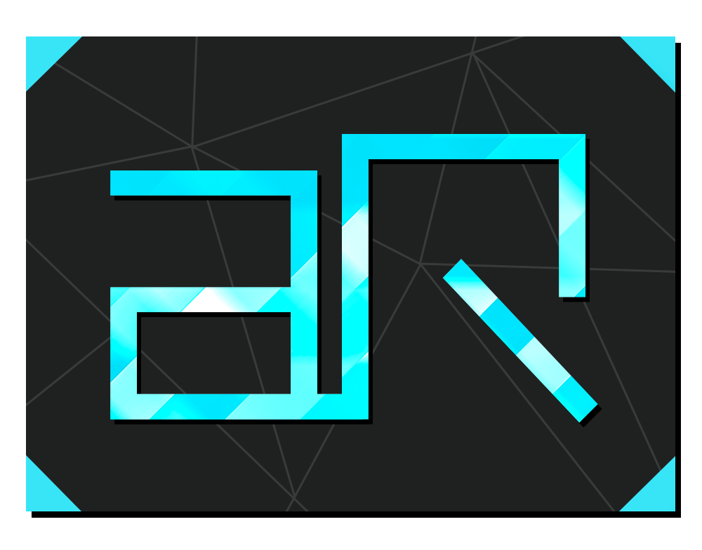
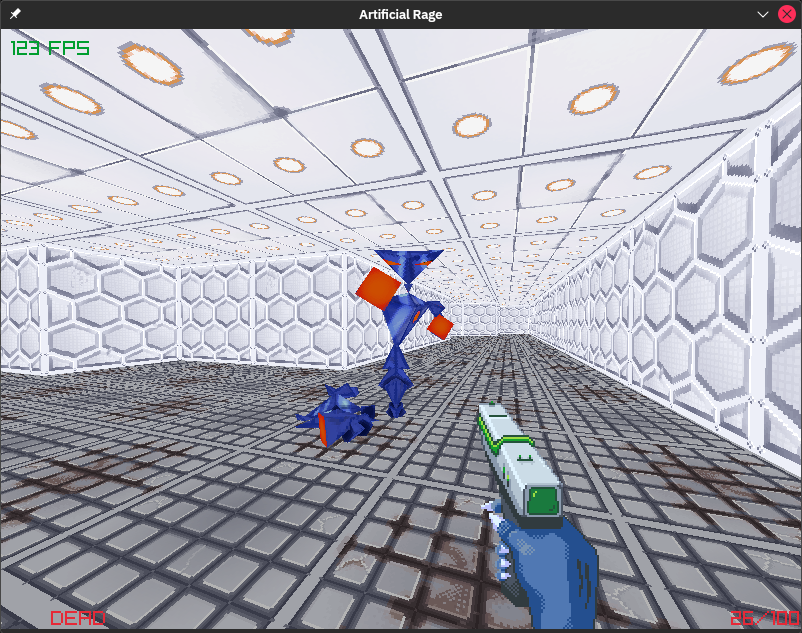

-------

  <h1> Artificial Rage - a Scifi FPS </h1>
   
  
   
  
   

-------

A simple FPS project (Wolfenstein 3D clone), made with [Raylib](https://www.raylib.com/) and pure C.

This project is a learning platform for me to learn C. I also hope one day this game will be fun to play, and I want
people to tinker with the source code, create mods, maps etc..

I also want this project to be a starting point for some who want to make their own simple FPS, or they could use this
as a learning tool.

## Howto compile for different platforms

* IF the CMake file doesn't do this for you, compile raylib for your platform from source

* Run the following commands in project root to build the binary
    * `mkdir build && cd build`
    * `cmake ../`
    * `make`

**Remember to run "cmake configure" in vscode (or equivalent in any other system) before building, when adding new
files.**

## TODO:
Check this project for TODO list: https://codeberg.org/akselmo/artificial-rage/projects/1358

